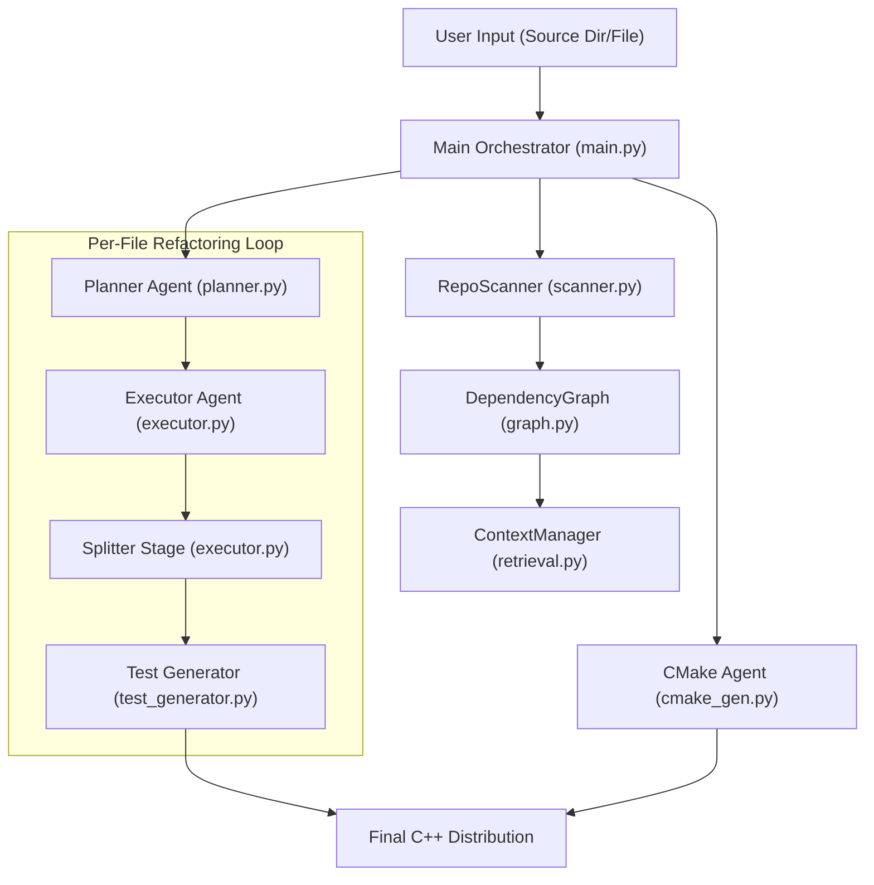

# Antigravity Refactoring Agent: Technical Specification

This document provides a detailed breakdown of the Antigravity Refactoring Agent's architecture, including its sub-agents, cognitive pipeline, and input/output specifications.

## 🏗️ System Architecture

The agent follows an **Orchestrated Multi-Agent** design. It separates "Repository Understanding" (Cognition) from "Code Generation" (Execution).

---

## 🧩 Module Specifications

### 1. Repository Cognition Layer

| Module              | Description                                                           | Inputs                      | Outputs                             |
| :------------------ | :-------------------------------------------------------------------- | :-------------------------- | :---------------------------------- |
| **RepoScanner**     | Recursively scans for source files while respecting `.gitignore`.     | Root Directory Path         | List of Source File Paths           |
| **DependencyGraph** | Builds a Directed Acyclic Graph (DAG) based on imports/symbols.       | List of Parsed Source Files | Topological Sort Order              |
| **ContextManager**  | Manages interface registration and context retrieval for refactoring. | Source Path, Parsed Code    | Relevant Headers/Interface Snippets |

### 2. Specialized Sub-Agents

#### **Planner Agent (`planner.py`)**

- **Role**: Analyzes a single file and devises a step-by-step refactoring strategy.
- **Inputs**:
  - `Source Path`: Location of the file.
  - `Source Code`: Original Python logic.
- **Outputs**: `Plan` object (A sequence of granular refactoring tasks).

#### **Executor Agent (`executor.py`)**

- **Role**: Performs the actual code conversion.
- **Inputs**:
  - `Refactoring Task`: Granular instruction from the Planner.
  - `Source Code`: Original snippet.
  - `Dependency Context`: Headers/Interfaces of other files in the repo.
- **Outputs**: Generated C++ block (untrimmed).

#### **Splitter Stage (`executor.py`)**

- **Role**: Post-processes the generated C++ to separate declarations and definitions.
- **Inputs**: Single raw C++ code block.
- **Outputs**: Map of filenames to contents (e.g., `filename.hpp`, `filename.cpp`).

#### **CMake Agent (`cmake_gen.py`)**

- **Role**: Orchestrates the build system for the entire refactored distribution.
- **Inputs**: Global list of all generated files in the `final/` directory.
- **Outputs**: Root `CMakeLists.txt` with GTest integration.

---

## 🔄 Data Flow (Lifecycle)

1.  **Ingestion**: `Scanner` finds all files. `Graph` calculates the safest refactoring order (dependencies first).
2.  **Verification**: (Optional) `BaselineVerifier` runs the original Python code to capture "Golden Results".
3.  **Refactoring Loop**:
    - `Planner` breaks the file into tasks (e.g., "Refactor Header", "Refactor Method X").
    - `Executor` generates C++ code sequentially, using the `ContextManager` to "see" other refactored files.
    - `Splitter` enforces the `.hpp`/`.cpp` convention.
    - `TestGenerator` creates GTest files.
4.  **Distribution**: `CMake Agent` links subsystems and builds the infrastructure.
5.  **Reporting**: `Reporter` generates run logs and the final walkthrough.

---

_Technical Documentation generated for Antigravity Agent v2.3_
