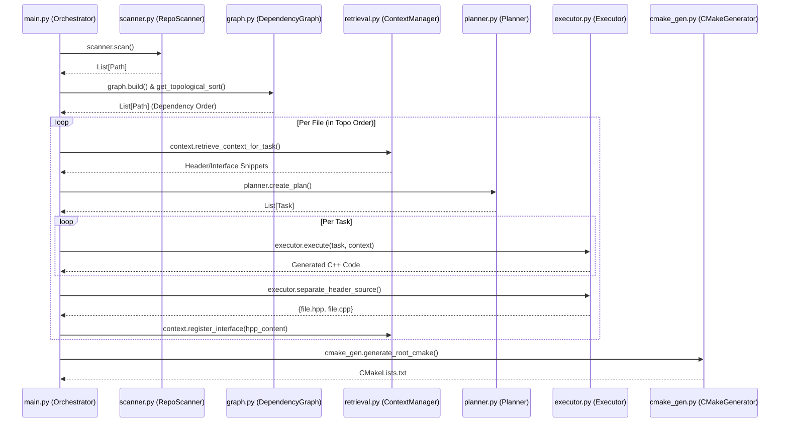

# Antigravity Agent: Granular Component Guide

This guide provides a file-by-file breakdown of the Antigravity Refactoring Agent's source code, its core functions, and how they connect to form the refactoring pipeline.

## 🏗️ Core Execution Flow

---

## 📂 File-by-File Breakdown

### 1. `main.py` (The Brain)

- **Purpose**: Orchestrates the entire lifecycle. It initializes all sub-agents and manages the per-file refactoring loop.
- **Core Function**: `run_repo(ctx, root_path, prompt)`
  - **Input**: Repository root path, refactoring instructions.
  - **Output**: Full C++ project in the `runs/` directory.
  - **logic**: Calls `scanner` -> `graph` -> Loop `process_single_file` -> `cmake_gen`.

### 2. `cognition/scanner.py`

- **Purpose**: Locates all relevant files in the target repository.
- **Core Function**: `RepoScanner.scan()`
  - **Input**: Root Path.
  - **Output**: `List[Path]` (Clean list of files to process).

### 3. `cognition/graph.py`

- **Purpose**: Determines the correct order of refactoring. We must refactor dependencies (like `sensor.py`) before their dependents (like `alarm.py`).
- **Core Function**: `DependencyGraph.get_topological_sort()`
  - **Input**: List of files.
  - **Output**: Ordered List of files (Dependency-safe sequence).

### 4. `cognition/retrieval.py`

- **Purpose**: Provides "memory". When refactoring a file, it retrieves the C++ headers of its already-refactored dependencies so the `Executor` knows what types/methods to call.
- **Core Function**: `ContextManager.retrieve_context_for_task()`
  - **Input**: Target file path.
  - **Output**: String containing relevant C++ header signatures.

### 5. `agents/planner.py`

- **Purpose**: Break down a single conversion task into a structured plan (LLM-driven).
- **Core Function**: `Planner.create_plan()`
  - **Input**: Python source code.
  - **Output**: `Plan` (List of JSON-parseable tasks like "Convert Class X", "Convert Tests").

### 6. `agents/executor.py`

- **Purpose**: The actual "Hands-on" coder. It converts logic blocks and splits them into the professional C++ format.
- **Core Function 1**: `Executor.execute()`
  - **Input**: Task description, Python snippet, Dependency context.
  - **Output**: Raw C++ code.
- **Core Function 2**: `Executor.separate_header_source()`
  - **Input**: Combined C++ logic.
  - **Output**: Map: `{ "file.hpp": content, "file.cpp": content }`.

### 7. `agents/cmake_gen.py`

- **Purpose**: Finalizes the project by creating the build system.
- **Core Function**: `CMakeGenerator.generate_root_cmake()`
  - **Input**: List of all generated files.
  - **Output**: A fully working `CMakeLists.txt` file.

---

## 🔗 Connection Summary

1.  **Scanner** gives names to **Graph**.
2.  **Graph** gives the order to **Main**.
3.  **Main** gives Python code to **Planner**.
4.  **Planner** gives instructions to **Executor**.
5.  **ContextManager** feeds previous **Executor** results back into current **Executor** calls.
6.  **CMakeGenerator** wraps all **Executor** outputs into a buildable package.
