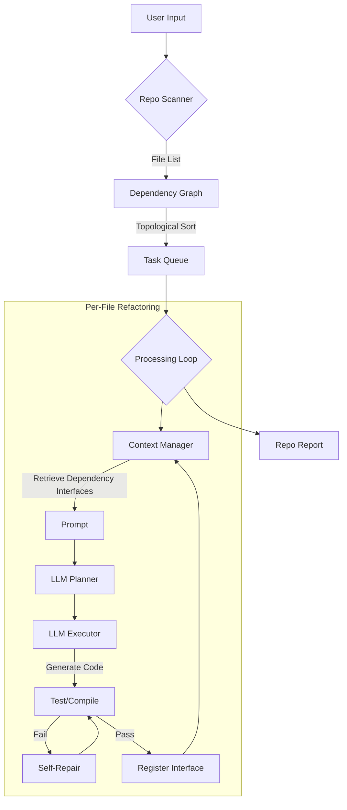

# MVP Refactoring Agent (V2)

A powerful, autonomous agent for refactoring code (e.g., Python to C++) with repository-level intelligence.

## 🚀 Key Features

- **Repository-Scale Refactoring (V2)**: Automatically scans directories, builds a dependency graph, and refactors files in topological order (leaves first).
- **Context Awareness (GraphRAG)**:
  - **Dependency Graph**: Explicitly maps file dependencies.
  - **Vector RAG**: Uses `llama3` (or other models like `nomic-embed-text`) to generate embeddings and retrieve semantically similar code chunks from the codebase.
- **Baseline Verification**: Automatically creates a test harness to capture the behavior of the original code ("ground truth") before any changes.
- **Self-Healing Execution**: Generates code, verifies compilation/tests, and auto-fixes errors using LLM feedback loops.
- **Robust Parsing**: Uses Regex-based scanning (fallback from Tree-sitter) for reliable import detection.
- **Automated Build (CMake)**: Automatically generates `CMakeLists.txt` for the refactored project.
- **Git Integration**: Safely experiments on new branches for each run.

## 🛠️ Installation & Usage

### Prerequisites

- Python 3.10+
- `uv` (for dependency management)
- Ollama running locally (default: `http://localhost:11434`) with `gpt-oss:20b` or similar.

### Installation

```bash
git clone <repo>
cd MVP_agent
uv sync
```

### Running the Agent

**Single File Mode:**

```bash
uv run python -m mvp_agent.main --source /path/to/script.py
```

**Repository Mode (V2):**

```bash
uv run python -m mvp_agent.main --source /path/to/project_root
```

> **Note**: The agent uses `llama3:latest` for embeddings by default. For better retrieval performance, we recommend pulling a specialized embedding model from Hugging Face via Ollama:
>
> ```bash
> ollama pull nomic-embed-text
> # Then update embedding_model in src/mvp_agent/main.py
> ```

The agent will:

1.  Recursively scan for source files.
2.  Build a dependency graph.
3.  Refactor files in the correct order (`utils` -> `core` -> `main`).
4.  Generate a C++ implementation for each file.

## 🧩 Architecture (V2)



## ⚠️ Known Limitations & Roadmap

- **Header Management**: Currently, the agent may **inline** dependency code (e.g., `MathUtils` class) into `main.cpp` to ensure compilation, rather than creating separate `.hpp` files and `#include` directives. Future work will enforce strict Header/Source separation.
- **Context Window**: For extremely large repositories, passing full file contents as context will hit token limits. Future versions will implement a Vector DB (RAG) to retrieve only relevant snippets.
- **Build System**: The agent generates `CMakeLists.txt` to link the generated C++ files, enabling immediate compilation.

## 🔮 Retrospective & Design Decisions

See `docs/retrospective.md` for a detailed log of technical challenges (e.g., Tree-sitter vs Regex) and architectural choices.
