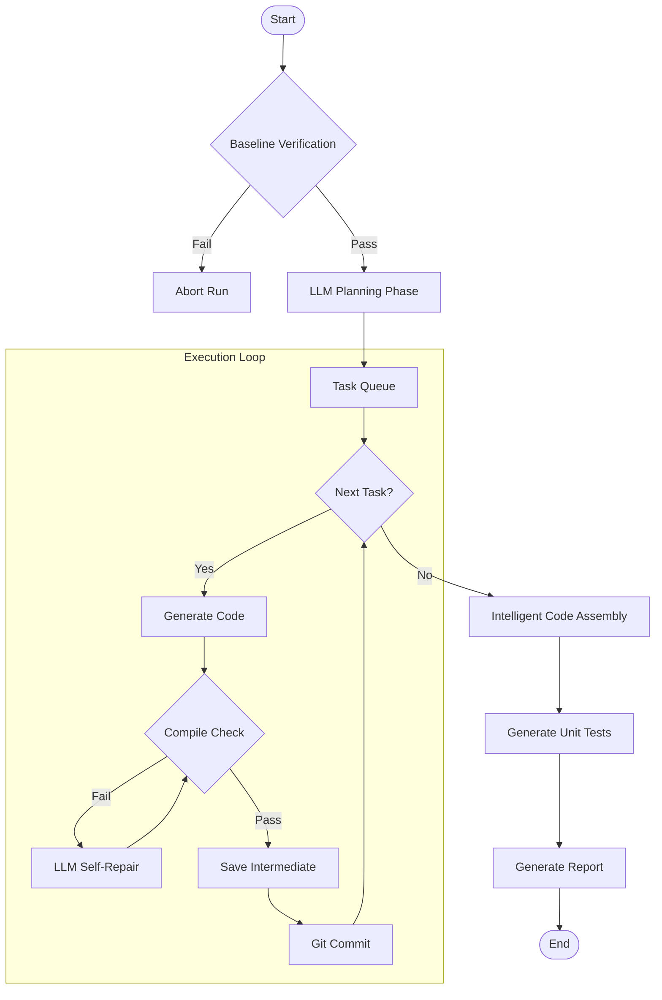

# MVP Refactoring Agent

Refactoring Agent designed to automate the conversion of code (e.g., Python to C++) with a robust, self-correcting workflow.

## 🚀 Key Features

- **Baseline Verification:** Automatically creates a test harness to capture the behavior of the original code, establishing a "ground truth" before any changes are made.
- **LLM-Driven Planning:** Analyzes source code and creates a step-by-step refactoring plan, breaking down complex files into manageable tasks (headers, classes, functions).
- **Self-Healing Execution:**
  - Generates code for each task.
  - Verifies compilation immediately.
  - If compilation fails, feeds the error back to the LLM to auto-fix the code (up to 3 retries).
- **Intelligent Assembly:** intelligently merges generated code chunks into a single, clean file, handling duplicated headers and namespace issues.
- **Timestamped History:** All runs are isolated in `runs/<timestamp>/` to preserve history and prevent overwriting.
  - `output/final/`: Assembled code and generated unit tests.
  - `output/intermediate/`: Individual task chunks and baseline harness.
  - `logs/`: Detailed execution logs and `llm_trace.jsonl` (full prompt/response history).
- **Git Integration:** Automatically branches for each run and commits after each successful task, enabling easy rollback and history tracking.

## 🛠️ How to Run

### Prerequisites

- Python 3.10+
- `uv` (for dependency management)
- Ollama running locally (default: `http://localhost:11434`) with a model like `gpt-oss:20b`.

### Command

Run the agent on a single source file:

```bash
uv run python -m mvp_agent.main --source <path_to_file>
```

**Options:**

- `--prompt "Task description"`: Custom prompt (default: "Convert this Python code to C++").
- `--model <model_name>`: Specify Ollama model (default: `gpt-oss:20b`).
- `--skip-baseline`: Skip the baseline verification step (useful for quick iterations if baseline is known good).
- `--no-git`: Disable git branching/commits.

### Output

Check `runs/<timestamp>/`:

- `output/final/test.cpp`: The refactored code.
- `output/final/test_test.cpp`: Generated unit tests.

## 🧩 Architecture Flowchart



## ⚠️ Current Limitations (Gap Analysis)

This MVP is a powerful proof-of-concept but has specific limitations when compared to a full-scale enterprise refactoring tool.

### 1. Scope: Single File vs. Repository

- **Current:** operate on a **single source file**. It assumes the file is relatively self-contained or only relies on standard libraries.
- **Gap:** Large projects (`2026 CareerHack Workshop_TSID`, etc.) involve minimal dependency chains, shared custom types, and build system configurations (CMake, Makefiles).
- **Solution Needed:**
  - **Repository Crawler:** Recursive file scanning.
  - **Dependency Graph:** Topological sort to refactor dependencies _before_ the files that import them.
  - **Context Manager:** A system to pass signatures/interfaces of already-refactored files to the LLM so it knows how to call them.

### 2. Context Window & Complexity

- **Current:** Reads the full file content into the prompt.
- **Gap:** For massive files (>2000 lines), context limits will be hit, or LLM performance will degrade (hallucinations/forgetting).
- **Solution Needed:**
  - **RAG (Retrieval Augmented Generation):** Retrieve only relevant code snippets/definitions.
  - **Symbol Table:** Extract structural info (AST) instead of raw text.

### 3. Verification Depth

- **Current:** Checks _compilation_ and runs _generated_ unit tests.
- **Gap:** Generated tests might verify the _new_ code's internal logic but fail to catch functional regressions against the _original_ business logic if the prompt wasn't perfect.
- **Solution Needed:**
  - **Cross-Language Harness:** A unified test runner that executes BOTH the Python original and C++ refactor with the SAME inputs and asserts identical outputs (Golden Master Testing).

## 🔮 Roadmap to Large-Scale Refactoring

To handle the target projects, the following evolution is required:

1.  **Repository-Level Analysis**: Implement a "Scanner" that builds a file dependency graph.
2.  **Global Context Sharing**: Create a shared context (vector DB or summary file) where the agent "registers" public interfaces of files it has finished refactoring.
3.  **Build System Generation**: The agent must generate `CMakeLists.txt` or `Makefile` alongside the code.
4.  **Incremental Refactoring**: Ability to refactor one module at a time, keeping it interoperable with the rest of the legacy codebase (e.g., using pybind11 for Python/C++ hybrid state).
